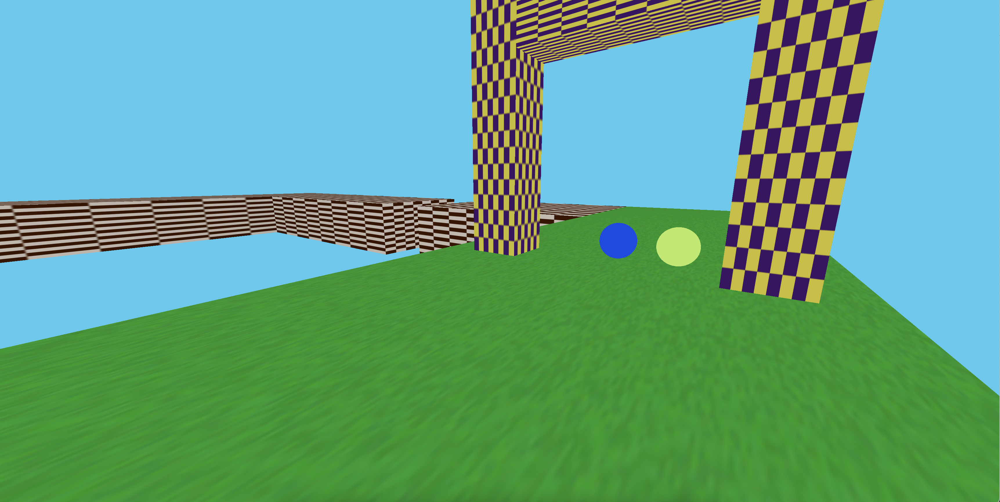
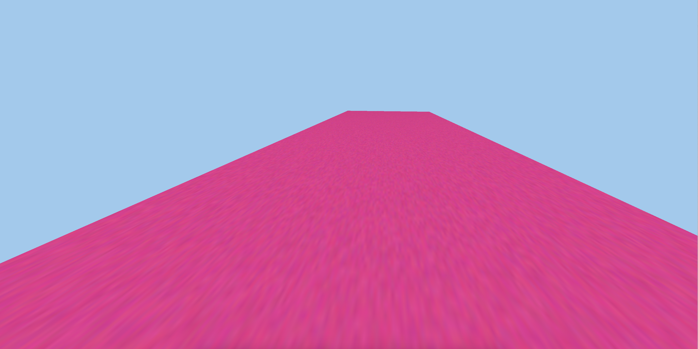
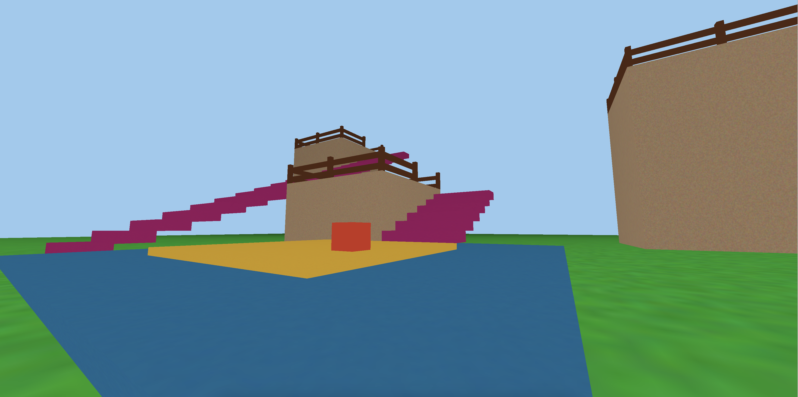

# Destination

Destination is a game programming environment that supplies several essentials in one place while emphasizing leanness and procedural generation.

It is a fork of [3gw](https://github.com/samybencherif/3gw).

Screenshot from [82e8c22](https://github.com/SamyBencherif/3gw/commit/82e8c22d2261f6648b66564825de7ef3d2df2e10) using Three.JS rendering and Cannon.js physics.

## Demo Scenes

Currently the engine comes with a handful of demo scenes that I'm developing to test out features.

### Scene 1

Features a couple of interactive balls, an arch, and some walking space

### Scene 2

Features almost nothing. This scene was created to test the scene loader.

### Scene 3

Consists of some fenced pillars and stairs. This scene shows more involved use of the geometry spawning API.

## Basic requirements

- 3D rendering (provided by Three.JS)
- 3D physics (provided by Cannon.js)
- First person controller
- Multiplatform, with NO build stack

## Extended requirements

- Common game mechanics (E to interact/pick up, trigger zones, 3D audio)
- Common technical features (pause menu, saves, graphics settings, cheat console)
